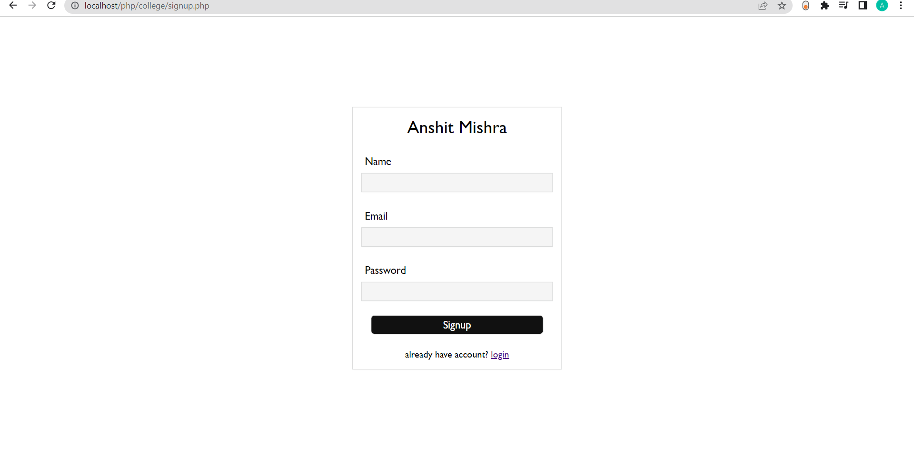
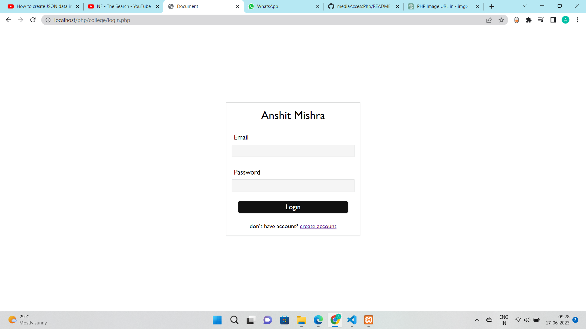
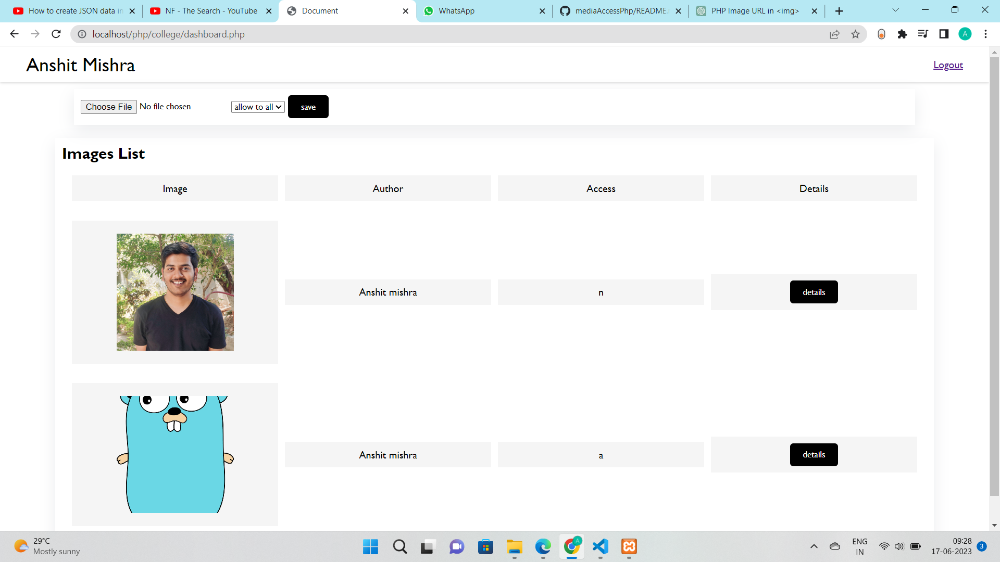

# mediaAccessPhp

# Image Upload PHP Project

This is a PHP project that enables users to upload images and access them.


## Features

- Image upload functionality
- Image retrieval and display

## Table of Contents

- [Getting Started](#getting-started)
- [Usage](#usage)
- [Contributing](#contributing)
- [License](#license)

## Getting Started

To get started with the project, follow these steps:

1. Clone the repository:

   ```bash
   git clone https://github.com/anshitmishra/mediaAccessPhp.git


## Screenshots






## License

The project is licensed under the [Apache License](LICENSE).
